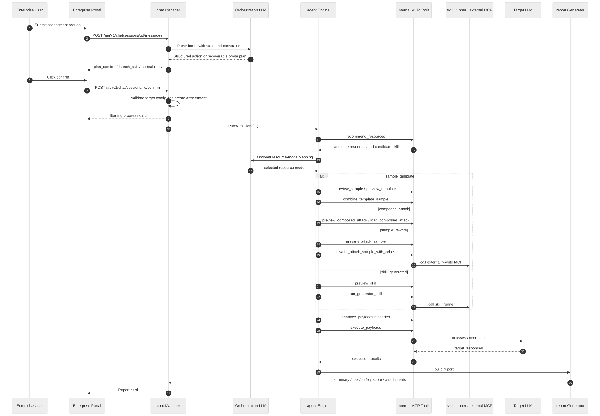

# 当前智能体工作流与架构梳理

## 1. 文档目的

这份文档描述的是**当前仓库里已经实现并正在运行的智能体形态**，重点回答以下问题：

- 企业门户里的一次智能体交互，实际上经过了哪些阶段。
- 当前“智能体”到底是自由 Agent、受控工作流，还是两者的混合。
- Skill、外部 MCP、专家资源、被测 LLM、报告生成分别在什么位置参与。
- 当前框架有哪些优点、边界和明显限制。

本文档对应的关键实现文件主要包括：

- `cmd/server/main.go`
- `internal/chat/session.go`
- `internal/agent/engine.go`
- `internal/agent/executor.go`
- `internal/mcptools/`
- `internal/externalmcp/`
- `internal/skill/`
- `docs/qagent-controlled-orchestration.md`
- `docs/qagent-skill-workflow.md`

## 2. 一句话定义当前智能体

当前系统里的“智能体”，更准确地说是一个**受控编排型评测智能体**：

- 前面由编排 LLM 理解用户意图、生成计划卡片。
- 中间由平台代码掌握流程主权，控制什么时候允许生成计划、什么时候允许执行、什么时候只能打开 Skill 页面。
- 后面由 `agent.Engine` 驱动内部 MCP 工具、Skill、外部 MCP 和执行模块完成真正的评测。
- 整个过程不是完全自由的自治 Agent，而是“**LLM 决策 + 代码约束 + 工具白名单 + 人工确认**”的混合架构。

换句话说，当前产品不是“放手让 Agent 自己想怎么做就怎么做”，而是“平台规定大框架，LLM 在框架里做语义决策”。

## 3. 当前整体架构

### 3.1 组件关系图

Mermaid 源文件：`docs/architecture/agent-architecture.mmd`

### 3.2 组件职责概览

| 组件 | 当前职责 | 关键文件 |
| --- | --- | --- |
| 企业聊天管理器 | 解析用户消息、调用编排 LLM、生成计划卡、确认执行、写入聊天记录 | `internal/chat/session.go` |
| 评测编排引擎 | 把计划落成资源选择、载荷准备、增强、执行、报告 | `internal/agent/engine.go` |
| 执行器 | 统一 MCP 工具调用、超时、调用日志、工具级兜底 | `internal/agent/executor.go` |
| 内部 MCP 工具层 | 对平台能力做工具化封装 | `internal/mcptools/` |
| 外部 MCP 管理器 | 同步、代理、桥接外部 MCP 能力 | `internal/externalmcp/` |
| Skill 域服务 | Skill 导入、配置、自测、发布、运行请求 | `internal/skill/` |
| Skill Runner | 用隔离容器执行 `generator_skill` | `cmd/skillrunner/main.go` |
| 报告生成器 | 汇总执行结果、计算风险与安全分、生成报告 | `internal/report/` |

## 4. 当前智能体的主工作流

### 4.1 企业聊天到评测执行的时序图

Mermaid 源文件：`docs/architecture/current-agent-workflow-sequence.mmd`

### 4.2 会话状态与执行状态

当前并不是一个“连续自由对话”驱动的一体化 Agent，而是一个有明显阶段边界的流程型系统。

Mermaid 源文件：`docs/architecture/current-agent-workflow-state.mmd`

## 5. 当前“框架”到底是什么

### 5.1 不是纯 ReAct，而是混合框架

当前实现里确实保留了偏 ReAct 的通用 Agent 路径，但**它已经不是主路径**。

可以把当前框架理解为三层：

1. **聊天规划层**
   - 用编排 LLM 理解需求、生成结构化计划。
   - 关键特征是 `confirm_plan`、`start_assessment`、`launch_skill` 这些结构化动作，而不是完全自由文本。

2. **受控执行层**
   - 真正的评测走 `agent.Engine.RunWithClient(...)`。
   - 主路径优先是“计划式流水线（planned pipeline）”，不是工具自由探索。
   - 如果计划式路径失败，再做 deterministic fallback。

3. **工具执行层**
   - 所有真正的资源访问、数据生成、样本改写、执行、报告都通过内部 MCP 工具完成。
   - 这意味着 Agent 并不直接访问数据库、对象存储或外部服务，而是通过受控工具面操作。

### 5.2 当前框架的真实关键词

如果要给当前系统贴标签，我认为最准确的是：

- `Stateful`: 有显式会话状态和评测阶段状态。
- `Human-in-the-loop`: 执行前有确认门。
- `Plan-and-execute`: 先计划、再执行。
- `Tool-constrained`: 工具白名单驱动，不是任意动作。
- `Hybrid`: LLM 负责语义判断，代码负责强约束和兜底。
- `Artifact-handle based`: 尽量让大模型拿摘要和句柄，而不是完整敏感数据。

## 6. 企业聊天层的真实工作流

### 6.1 用户发消息之后发生了什么

`internal/chat/session.go` 里的主入口会做这些事：

1. 加载会话、校验用户归属。
2. 存储用户消息。
3. 读取历史消息与当前会话状态。
4. 组装单条 system prompt，把对话约束、计划输出规范、可打开的 `interactive_web_skill` 候选合并进去。
5. 调用编排 LLM。
6. 解析返回内容：
   - 如果是 `confirm_plan`，就写计划卡片并把会话切到 `confirming_plan`。
   - 如果是 `launch_skill`，就返回打开 Skill 页面的卡片。
   - 如果是 `start_assessment` 但用户还没点确认，会改成提示用户先确认。
   - 如果 LLM 没严格返回 JSON，而是吐出一段“评估计划概要”文本，后端会尝试把这段 prose 恢复为真正的计划卡片。

### 6.2 为什么它不是“聊着聊着自动就跑起来”

因为当前产品刻意保留了一个人工确认门：

- 企业用户先得到计划卡片。
- 看完评估名称、目标、类型、资源模式、测试数量后，再点确认。
- 确认后才真正创建 `assessment` 并进入后台执行。

这意味着当前的智能体更像“**评测编排助手 + 受控执行系统**”，而不是完全自动的任务代理。

## 7. 评测编排引擎的真实工作流

### 7.1 主入口：`RunWithClient(...)`

当前真正承接企业评测执行的主路径是 `agent.Engine.RunWithClient(...)`。它大体做以下几件事：

1. 基于计划信息进入“计划式评测流水线”。
2. 调用 `recommend_resources` 收集当前可用的样本、模板、组合攻击、已发布 Skill 等候选。
3. 根据用户计划、可用候选和语义信息，决定应该走哪一种资源模式。
4. 为选中的模式准备真正的 `payload_dataset`。
5. 如需要，再对载荷做增强。
6. 调用执行工具批量访问被测目标。
7. 汇总结果并生成报告。

### 7.2 当前资源模式分支

当前至少有四条核心资源模式：

| 资源模式 | 说明 | 当前典型用途 |
| --- | --- | --- |
| `sample_template` | 专家样本 + 模板组合生成测试载荷 | 常规评测、模板化攻击 |
| `composed_attack` | 直接使用已经组合好的攻击链 | 已验证可复用的策略包 |
| `sample_rewrite` | 只用样本，再交给外部改写能力重写 | 文言文 / 古文改写等特殊语言形态 |
| `skill_generated` | 通过已发布 `generator_skill` 动态生成载荷 | 第三方策略、复杂生成逻辑 |

### 7.3 模式选择不是纯硬编码，也不是完全自由

当前模式选择是个混合过程：

- 先由代码通过 `recommend_resources` 获取候选。
- 再由编排 LLM 在候选集合里做语义选择。
- 如果 LLM 输出不可用、候选不合法、依赖能力不可用，代码会进行强校验和兜底。

所以它不是：

- 纯关键词路由。
- 纯自由 Agent 自己决定一切。

而是：

- “**语义规划优先，代码合法性校验兜底**”。

## 8. Skill 与外部 MCP 在当前体系里的位置

### 8.1 当前 Skill 有两种形态

当前平台里应该明确区分两类 Skill：

| Skill 形态 | 用途 | 是否进入评测执行链 | 是否走 `skill_runner` |
| --- | --- | --- | --- |
| `generator_skill` | 生成标准 `payload_dataset` | 是 | 是 |
| `interactive_web_skill` | 打开一个交互式网页能力页面 | 否 | 否 |

这两个概念不能混用：

- `generator_skill` 是评测能力。
- `interactive_web_skill` 是页面型工具入口。

### 8.2 `generator_skill`

`generator_skill` 在当前系统里不是“聊天插件”，而是**受管的载荷生成能力**：

1. 专家端导入 ZIP。
2. 后端解析 `skill.yaml`。
3. 专家端配置 `config_schema`。
4. 自测通过后发布。
5. 企业侧规划到 `skill_generated` 时，通过内部工具 `preview_skill` / `run_generator_skill` 使用它。
6. 实际执行交给 `skill_runner` 隔离容器。

关键点在于：

- Skill 最终仍需输出平台标准的 `payload_dataset`。
- 中间结果不会直接整包回传给编排 LLM。
- 平台执行层仍然掌握主流程。
- `skill_runner` 当前只服务于 `generator_skill`，不是所有 Skill 的统一运行时。

### 8.3 `interactive_web_skill`

`interactive_web_skill` 的定位完全不同：

- 它的作用是给企业用户打开一个已经发布的网页能力。
- 企业聊天层会返回 `launch_skill` 卡片。
- 前端随后打开 `/enterprise/skills/:id/open`。
- 这条链路**不会**进入评测执行流水线。
- 它也**不会**调用 `skill_runner` 生成载荷。

所以当用户命中某个 `interactive_web_skill` 时，系统行为应该理解为：

- “打开一个能力页面”

而不是：

- “开始一轮评测任务”

### 8.4 外部 MCP

外部 MCP 当前主要承担“平台外能力接入”的角色，例如 CCBOS 文言文改写。

工作方式是：

1. 外部 MCP 在专家门户配置、启用、健康检查。
2. `externalmcp.Manager` 负责把它们纳入平台可用能力。
3. 内部 MCP 工具通过命名空间查找启用的外部 MCP 服务并转发调用。

这意味着外部 MCP 不是直接裸暴露给企业聊天，而是先被平台收编进受控工具面。

### 8.5 Skill 与外部 MCP 的关系

当前两者都属于“能力来源”，但交付形态不同：

- Skill 更偏“平台管理的本地或半本地能力包”。
- 外部 MCP 更偏“平台桥接的外部服务能力”。

从产品形态上看，它们未来很可能会继续向统一能力注册中心演进，但当前实现里还是两套接入路径。

## 9. 数据与隐私边界

这是当前设计里很重要、也很容易被忽视的一点。

### 9.1 编排 LLM 不应拿到完整敏感载荷

无论是 `sample_rewrite` 还是 `skill_generated`，当前实现都刻意避免让编排 LLM 直接拿到完整最终 payload：

- 外部改写工具返回的是句柄、摘要、数量等元信息。
- `run_generator_skill` 也会把完整数据集落到 session store，再返回 `handle_only` 摘要。

### 9.2 控制面与数据面已经初步分离

可以把当前系统粗略理解成：

- **控制面**：聊天规划、模式决策、阶段流转、确认执行。
- **数据面**：载荷生成、改写、增强、执行、结果收集。

虽然现在分离还不算彻底，但思路已经很明显：让 LLM 更多看摘要和结构化元信息，而不是完整数据正文。

## 10. 当前已有的“智能体能力”

### 10.1 已经具备的能力

- 能理解企业用户需求并生成计划卡片。
- 能根据当前可用能力源推荐资源。
- 能在样本、模板、已组合攻击、`generator_skill`、外部改写之间进行受控选择。
- 能对 `interactive_web_skill` 执行“直接打开页面”的非评测型动作。
- 能执行多阶段评测并回传进度。
- 能生成结构化报告，并对外展示风险等级和安全分。

### 10.2 还不具备或较弱的能力

- 没有真正意义上的长期记忆。
- 不是多智能体协作架构。
- 主路径不是通用 ReAct，而是受控工作流。
- 不能完全自主决定是否跳过确认门。
- 对复杂运行环境的 Skill 支撑仍有限。
- 对失败恢复、跨会话经验积累、策略反思的支持还比较初级。

## 11. 当前设计的优点

### 11.1 比完全自由 Agent 更可控

平台代码掌握了：

- 会话状态。
- 可执行动作。
- 资源合法性。
- 工具白名单。
- 敏感数据回传边界。

这对安全评测产品非常重要，因为它天然是高风险业务场景。

### 11.2 比纯静态工作流更灵活

虽然系统受控，但它也不是纯硬编码路由：

- 聊天层会做语义理解。
- 执行层允许在候选集合里做基于语义的模式选择。
- Skill 和外部 MCP 可以作为能力来源动态增减。

### 11.3 比“全量数据进 LLM”更适合产品化

当前设计已经开始避免把完整 payload 直接暴露给编排 LLM，这对：

- 数据合规
- 成本控制
- 结果可审计
- 执行稳定性

都是有帮助的。

## 12. 当前设计的限制

### 12.1 它还不是完全自主智能体

当前系统距离“产品化自治 Agent”还有明显差距：

- 没有长期记忆层。
- 没有组织级经验沉淀。
- 没有完整的多角色协作。
- 没有系统化反思与自我纠错闭环。
- 没有统一的能力注册与调度中心。

### 12.2 现有框架是混合体，概念层次还不够统一

目前系统里同时存在：

- 聊天规划状态机
- 计划式评测流水线
- 遗留的通用 ReAct 式执行路径
- Skill 路径
- 外部 MCP 路径

这说明系统具备演进弹性，但也意味着认知成本较高，后续如果继续产品化，建议进一步统一为“显式状态机 + 能力注册中心 + 工件句柄流转”。

### 12.3 Skill Runtime 仍偏轻量

当前 `skill_runner` 更适合：

- Python 项目
- `requirements.txt` 依赖
- 输出标准 `payload_dataset`

对于需要复杂系统依赖、浏览器、GPU、特定镜像或多进程服务的项目，当前 Skill 体系还不够强。

## 13. 建议如何理解当前产品形态

如果要用一句更适合对外介绍的话来总结当前实现，我会这样表述：

> 当前平台已经不是“单纯聊天机器人”，而是一个以企业聊天为入口、以受控编排为核心、以 MCP / Skill 为执行底座的 AI 安全评测智能体系统。

再拆开说，就是：

- 聊天只是入口。
- 计划卡是控制点。
- `agent.Engine` 是核心编排器。
- MCP 工具是执行底座。
- Skill 和外部 MCP 是能力供给层。
- 报告系统是结果交付层。

## 14. 后续阅读建议

如果你想继续往“未来产品化形态”推进，建议接着看这几份文档：

- `docs/qagent-controlled-orchestration.md`
- `docs/qagent-skill-workflow.md`
- `docs/skills/generator-skill-spec.zh-CN.md`

如果你想继续从代码角度深入，建议从这几个入口继续：

- `internal/chat/session.go`
- `internal/agent/engine.go`
- `internal/agent/executor.go`
- `internal/mcptools/planning_tools.go`
- `internal/mcptools/skill_tools.go`
- `internal/mcptools/external_rewrite_tools.go`
- `cmd/server/main.go`
