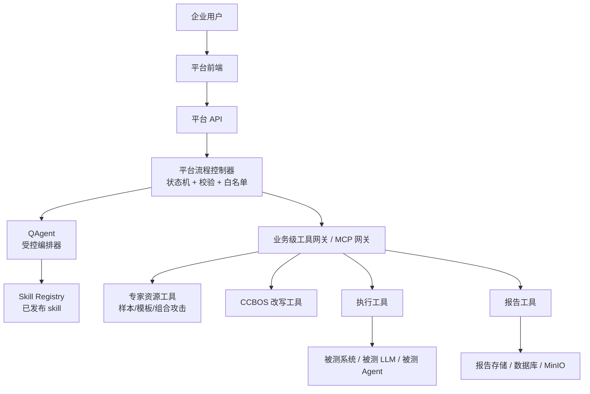

# QAgent 受控编排接入方案

## 1. 背景

当前项目已经具备一套自研的评测编排能力：

- 企业侧聊天入口负责理解用户需求并生成计划卡片
- `agent.Engine` 负责在既定流程中选择资源、准备载荷、执行测试和生成总结
- 平台通过内部 MCP 工具层统一调度专家资源、CCBOS 改写能力、执行与报告能力

现在的目标不是把 QAgent 作为“被测对象”接入，而是让 QAgent 成为新的上层编排器，同时继续复用项目现有的：

- 专家门户资源
- MCP 工具生态
- CCBOS 改写链路
- 执行与报告能力

同时，后续还计划引入 skill 体系，因此新的接入方案必须同时兼容：

- QAgent 的 skill 机制
- 平台现有的 MCP / 业务工具层
- 对流程的强约束与可审计性

## 2. 核心判断

QAgent 可以接入当前项目做工作流编排，但必须采用“受控编排”模式，不能把流程主权完全交给 QAgent 自由发挥。

原因：

1. 当前项目的价值不只是模型调用，而是一套被代码强约束的评测流程
2. 专家资源、CCBOS 改写、中间结果脱敏、执行超时、回退策略、日志与报告都已经沉淀在现有代码里
3. 真正的通用 agent 往往倾向于自主决定下一步，如果没有外层状态机约束，很容易偏离平台要求的固定流程

因此，推荐模式是：

- QAgent 负责高层理解、规划与受限决策
- 平台代码负责流程状态推进、参数校验、工具白名单、中间数据隔离和最终执行

一句话概括：

- `QAgent = 受控编排器`
- `Skill = 能力说明与场景知识`
- `平台代码 = 流程控制器`
- `MCP 工具 = 执行底座`

## 3. 设计目标

### 3.1 目标

1. 用 QAgent 替换当前聊天侧与部分规划侧的 LLM 决策能力
2. 保留当前项目对流程顺序的强控制
3. 继续复用专家门户资源与平台已有 MCP 工具
4. 支持后续 skill 的导入与编排注入
5. 确保 `sample_rewrite` 等关键流程不会被 QAgent 绕过

### 3.2 非目标

1. 不在第一阶段让 QAgent 完全替代整个 `agent.Engine`
2. 不在第一阶段允许 QAgent 自由访问全部底层原始 MCP 工具
3. 不在第一阶段开放任意代码执行型 skill

## 4. 接入原则

### 4.1 流程主权在代码

QAgent 不能直接掌控整条流水线。平台代码必须维护显式状态，并且只有状态转换合法时才推进。

### 4.2 QAgent 只看业务级工具，不看底层原始工具

不要把全部专家侧原始 MCP server 工具直接暴露给 QAgent。应由平台先做业务级封装，只把安全的、流程友好的工具暴露出去。

### 4.3 Skill 用于指导，不用于越权

Skill 的职责是补充：

- 适用场景
- 资源模式偏好
- 调用建议
- 约束
- 输出格式要求

Skill 不应让 QAgent 绕过平台代码的流程控制。

### 4.4 中间敏感内容不暴露给 QAgent

例如 `sample_rewrite` 模式中，CCBOS 改写后的完整载荷不应直接回传给 QAgent，只返回：

- 脱敏摘要
- 句柄
- 计数
- 质量/状态信息

## 5. 推荐总体架构



## 6. 受控工作流模型

推荐把当前流程显式拆成状态机，而不是让 QAgent 自由决定“下一步该干嘛”。

### 6.1 建议状态

1. `intent_collecting`
   收集用户目标与约束
2. `plan_drafting`
   生成计划卡片
3. `awaiting_confirmation`
   等待用户确认
4. `resource_selecting`
   选择样本 / 模板 / 已组合攻击 / 改写模式
5. `payload_preparing`
   组合或改写载荷
6. `payload_enhancing`
   做增强策略
7. `executing`
   调用被测目标
8. `reporting`
   生成报告
9. `completed`
10. `failed`

### 6.2 每个状态允许的动作

例如：

- `plan_drafting`
  QAgent 只能输出计划 JSON
- `resource_selecting`
  QAgent 只能在推荐候选里选资源
- `payload_preparing`
  QAgent 不能直接生成新载荷，只能请求“样本改写”或“模板组合”
- `executing`
  QAgent 不应控制逐条执行循环，执行循环由代码完成
- `reporting`
  QAgent 可以参与报告草拟，但报告保存与 PDF 生成仍由代码完成

## 7. QAgent 在第一阶段应负责什么

推荐第一阶段只让 QAgent 替换以下两块：

### 7.1 聊天规划

替换当前：

- 企业侧聊天需求理解
- 计划卡片生成

对应现有逻辑主要在：

- `internal/chat/session.go`

### 7.2 资源选择决策

替换当前：

- 在 `recommend_resources` 返回的候选中做最终选择

对应现有逻辑主要在：

- `internal/agent/engine.go`
  - `planPipelineWithLLM(...)`

### 7.3 第一阶段不建议交给 QAgent 的部分

1. 逐步推进执行流程
2. 直接调用全部原始专家 MCP
3. 逐条 payload 执行循环
4. 结果入库
5. 报告持久化与 PDF 上传
6. 超时、重试、回退策略

这些更适合继续留在平台代码里。

## 8. Skill 的定位

Skill 不应被设计成“自由执行脚本”，而应设计成“声明式策略包”。

### 8.1 推荐 skill 内容

- 名称
- 版本
- 描述
- 适用评测类型
- 适用资源模式
- 允许调用的工具集合
- 推荐调用顺序
- 输出格式要求
- 风险约束
- 示例

### 8.2 一个 skill 的作用

例如一个“文言文越狱测试” skill 可以告诉 QAgent：

1. 用户提到文言文 / CCBOS / classical Chinese jailbreak 时优先选择 `sample_rewrite`
2. 只允许从“样本”资源进入 CCBOS
3. 不允许使用模板或已组合攻击替代
4. 中间改写内容不应回传上层

但即使 skill 没写好，平台代码也应继续校验这些约束。

## 9. 推荐工具暴露策略

### 9.1 不要暴露给 QAgent 的底层原始工具

例如不建议直接给 QAgent 暴露：

- 所有外部 MCP 原始代理工具
- 任意无约束的原始样本/模板读取工具
- 返回大量敏感正文的工具

### 9.2 推荐暴露给 QAgent 的业务级工具

推荐只暴露经过平台封装的业务工具，例如：

1. `recommend_resources`
2. `preview_attack_sample`
3. `preview_template`
4. `preview_composed_attack`
5. `rewrite_attack_sample_with_ccbos`
6. `combine_template_sample`
7. `execute_payloads`
8. `generate_report`

后续如果接 skill，可以再增加：

9. `list_skills`
10. `match_skills`
11. `load_skill_context`

## 10. 如何保证 QAgent 不跑偏

要做到这一点，建议同时做四层约束。

### 10.1 状态约束

QAgent 当前所处状态决定它只能做什么。

### 10.2 工具白名单

每个状态只暴露有限工具。

### 10.3 结构化输出约束

QAgent 每一步都必须输出规定 JSON。

例如：

```json
{
  "mode": "sample_rewrite",
  "sample_id": "..."
}
```

### 10.4 代码校验与回退

即使 QAgent 给出不合法输出，代码也应：

1. 判定非法
2. 记录日志
3. 回退到 deterministic fallback

## 11. 建议的接入方式

### 11.1 新增 QAgent Adapter 层

建议新增一个对接层，把 QAgent 包装成当前平台可消费的编排接口。

例如新增：

- `internal/qagent/adapter.go`
- `internal/qagent/types.go`
- `internal/qagent/skill_registry.go`

这个 adapter 负责：

1. 向 QAgent 发送当前状态、候选工具、skill 摘要
2. 接收结构化输出
3. 校验输出
4. 转换为当前平台内部决策对象

### 11.2 先替换两处，再逐步扩大

第一阶段建议仅替换：

1. 企业聊天规划
2. 资源候选选择

不要第一阶段就替换整个 `agent.Engine`。

## 12. 现有代码改造点

### 12.1 聊天层

改造点：

- `internal/chat/session.go`

方向：

- 当前用编排 LLM 直接出计划卡片
- 改为通过 QAgent adapter 获取计划草案

### 12.2 Agent 规划层

改造点：

- `internal/agent/engine.go`

方向：

- 当前 `planPipelineWithLLM(...)` 由普通 LLM 做资源选择
- 可改为由 QAgent adapter 做受控选择

### 12.3 工具暴露层

改造点：

- `internal/mcptools/`
- `internal/externalmcp/`

方向：

- 把直接暴露给编排器的工具集收敛成“业务级工具白名单”

### 12.4 Skill 层

新增：

- skill registry
- skill metadata
- skill 导入 / 发布接口
- QAgent skill context 注入逻辑

## 13. 推荐实施阶段

### 阶段 1：受控规划接入

目标：

- QAgent 生成计划卡片
- QAgent 从推荐候选中做选择

不动：

- 执行器
- payload 执行循环
- 报告存储

### 阶段 2：skill 接入

目标：

- 支持专家导入 skill
- QAgent 在规划和选择时读取 skill 摘要

### 阶段 3：更细粒度的 agent 化

目标：

- 在少数中间步骤引入 QAgent 的更多受控能力

前提：

- 阶段 1 和 2 已经稳定

## 14. 工作量评估

### 小改

如果 QAgent 已经支持：

- MCP
- skill
- 结构化 JSON 输出
- 工具白名单

那么第一阶段接入通常属于中等工作量，而不是推倒重来。

### 大改

如果你要：

- 去掉当前 `agent.Engine`
- 让 QAgent 完全接管流程推进
- 让它直接访问所有底层 MCP

那就是大改，而且风险明显更高。

## 15. 最终建议

推荐采用如下策略：

1. 不替换当前流程控制器
2. 让 QAgent 成为“受控编排器”
3. skill 做知识层和编排偏好层
4. MCP 继续做执行底座
5. 第一阶段只替换聊天规划与资源选择

这是当前项目里最稳、最可落地、也最便于后续演进的方案。
