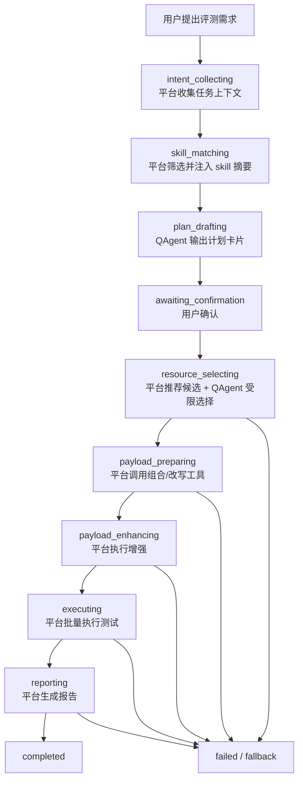

# QAgent + Skill 接入后的推荐流程

## 1. 目标场景

本文档描述的是这样一种未来形态：

1. `QAgent` 作为上层编排 agent
2. 平台支持导入和发布 `skill`
3. 专家门户的资源与能力仍然通过平台现有业务工具层 / MCP 工具层暴露
4. 平台代码继续掌握流程主权，不把完整流程完全交给 QAgent 自由发挥

这个方案的核心原则是：

- `QAgent` 负责理解、规划和受限决策
- `Skill` 负责知识、偏好、约束和调用建议
- `平台代码` 负责流程状态推进、参数校验、白名单、中间结果隔离和回退
- `MCP 工具层` 负责真实执行

## 2. 角色分工

### 2.1 QAgent

职责：

- 理解用户意图
- 结合 skill 输出计划卡片
- 在候选资源中做受限选择
- 在允许的状态内决定“下一步建议”

不负责：

- 越权改写流程骨架
- 直接访问所有底层原始工具
- 绕过平台校验
- 持久化结果
- 控制完整执行循环

### 2.2 Skill

职责：

- 告诉 QAgent 某类任务适合什么资源模式
- 约束允许使用的工具与参数
- 提供场景说明、方法论和输出格式要求
- 提供业务级规则，而不是执行代码

### 2.3 平台流程控制器

职责：

- 维护状态机
- 决定当前阶段允许暴露哪些工具
- 决定哪些输出合法
- 在 QAgent 失败或越界时回退到 deterministic fallback

### 2.4 MCP / 业务工具层

职责：

- 推荐资源
- 预览样本 / 模板 / 已组合攻击
- 调用 CCBOS 改写
- 执行载荷
- 生成报告

## 3. 推荐状态机

建议保留“代码主导”的状态机，QAgent 只在状态机内部做决策。

推荐状态：

1. `intent_collecting`
2. `skill_matching`
3. `plan_drafting`
4. `awaiting_confirmation`
5. `resource_selecting`
6. `payload_preparing`
7. `payload_enhancing`
8. `executing`
9. `reporting`
10. `completed`
11. `failed`

## 4. 端到端推荐流程

## 4.1 用户发起需求

用户输入类似：

- “请对被测 LLM 进行文言文越狱测试”
- “请对企业知识库问答系统做提示注入测试”

平台先进入 `intent_collecting`。

此时平台做两件事：

1. 解析基础上下文
   - 用户身份
   - 已配置的编排模型 / 被测目标
   - 当前组织下已发布 skill
2. 生成一个基础任务对象
   - 原始意图
   - 目标类型
   - 初步 assessment types

## 4.2 Skill 匹配

平台进入 `skill_matching`。

这个阶段不是让 QAgent 自己扫全量 skill，而是平台先做一次预筛选，再把匹配结果交给 QAgent。

建议流程：

1. 平台从 skill registry 里筛出候选 skill
2. 平台把 skill 摘要整理成受控上下文
3. 只把必要字段给 QAgent，例如：
   - skill 名称
   - 适用场景
   - 资源模式偏好
   - 工具白名单
   - 关键约束

例如，文言文越狱 skill 可以告诉 QAgent：

- 优先 `sample_rewrite`
- 只允许从样本进入 CCBOS
- 不允许用模板或已组合攻击替代
- 中间改写载荷不回传上层

## 4.3 QAgent 生成计划卡片

平台进入 `plan_drafting`。

此时 QAgent 的输入包括：

1. 用户原始需求
2. 已匹配 skill 摘要
3. 当前平台支持的评测类型
4. 当前支持的资源模式
5. 用户已配置的被测目标能力摘要

QAgent 输出结构化计划，例如：

```json
{
  "name": "文言文越狱测试",
  "goal": "使用专家样本经 CCBOS 改写为文言文形式后，对被测 LLM 进行越狱测试",
  "assessment_types": ["jailbreak"],
  "resource_mode_preference": "sample_rewrite",
  "test_count": 5
}
```

注意：

- QAgent 只能输出计划，不直接执行
- 平台仍然校验计划是否合法

## 4.4 用户确认

平台进入 `awaiting_confirmation`。

用户确认后，平台才真正创建评测任务。

这个阶段的作用不能被 skill 或 QAgent 跳过。

## 4.5 资源选择

平台进入 `resource_selecting`。

这个阶段建议采用“双层控制”：

1. 平台先调用 `recommend_resources`
2. 平台把候选结果做裁剪和脱敏
3. 平台再把候选摘要 + skill 约束交给 QAgent 做选择

例如：

- 若当前 skill 指向 `sample_rewrite`
- 则 QAgent 只能从 `recommended_samples_for_rewrite` 中选择
- 不允许输出模板 ID 或组合攻击 ID

QAgent 该阶段的输出建议固定为：

```json
{
  "mode": "sample_rewrite",
  "sample_id": "..."
}
```

平台校验：

1. `mode` 是否符合当前 skill 和 plan
2. `sample_id` 是否来自推荐候选
3. 是否越权选择了模板或已组合攻击

校验失败则回退。

## 4.6 准备载荷

平台进入 `payload_preparing`。

这里不要让 QAgent 自由拼接或自己写载荷，而应继续由平台业务工具执行。

### 4.6.1 若模式是 `sample_rewrite`

平台按固定顺序执行：

1. `preview_attack_sample`
2. `rewrite_attack_sample_with_ccbos`

QAgent 在这一阶段只需要知道：

- 已选择哪个样本
- 改写任务是否成功
- 导入了多少条结果

QAgent 不应看到：

- 改写后的完整敏感载荷正文

### 4.6.2 若模式是 `sample_template`

平台按固定顺序执行：

1. `preview_attack_sample`
2. `preview_template`
3. `combine_template_sample`

### 4.6.3 若模式是 `composed_attack`

平台按固定顺序执行：

1. `preview_composed_attack`
2. `load_composed_attack`

## 4.7 载荷增强

平台进入 `payload_enhancing`。

这一阶段可以让 skill 影响“增强策略偏好”，例如：

- `none`
- `multilingual`

但不建议让 QAgent 自己构造增强后的正文。

正确做法：

1. QAgent 可以输出建议策略
2. 平台校验该策略是否被当前 skill 允许
3. 平台调用 `enhance_payloads`

## 4.8 执行测试

平台进入 `executing`。

这一阶段建议完全由代码控制。

原因：

- 存在批量执行
- 存在 offset / batch size
- 存在成功率统计
- 存在超时、失败、回退

正确方式：

1. 平台调用 `execute_payloads`
2. 平台按批次执行
3. 平台收集结果
4. QAgent 只接收脱敏后的结果摘要

QAgent 可以参与：

- 对执行结果做高层总结

QAgent 不应接管：

- 执行循环
- 执行状态推进

## 4.9 报告生成

平台进入 `reporting`。

这一阶段推荐仍由平台控制：

1. 平台整理执行日志
2. 平台调用报告生成器
3. 生成结构化报告与 PDF
4. 保存到数据库 / MinIO

QAgent 可以参与：

- 生成摘要草稿
- 给出业务化结论

但报告最终持久化和 PDF 生成仍应由平台负责。

## 5. 流程图



## 6. 哪些地方由 skill 影响

接入 skill 后，skill 应该影响的是：

1. 计划生成偏好
2. 资源模式偏好
3. 候选排序
4. 工具白名单
5. 增强策略偏好
6. 报告标签和结论模板

## 7. 哪些地方不应由 skill 改写

skill 不应直接改写：

1. 是否需要用户确认
2. 是否跳过资源选择
3. 是否跳过载荷准备
4. 是否跳过执行
5. 是否跳过报告
6. 是否暴露敏感中间结果
7. 是否绕过平台校验

## 8. 推荐的第一阶段落地方式

如果未来真的接 QAgent + skill，建议第一阶段这样落地：

1. 平台继续保留当前状态机
2. Skill 先只用于计划生成和资源选择
3. QAgent 先只负责：
   - 计划卡片生成
   - 推荐候选中的受限选择
4. 执行、报告、中间数据保护继续复用现有平台代码

这是风险最低、最容易跑通的方案。

## 9. 最终结论

如果未来引入 skill，并让 QAgent 作为编排 agent，那么最合理的流程不是让 QAgent 自由决定整条流水线，而是：

- 让平台先做 skill 匹配和状态控制
- 让 QAgent 在每个受限阶段做结构化决策
- 让平台业务工具层继续负责真实执行

也就是说：

- 流程主权仍在平台代码
- skill 和 QAgent 让决策更智能
- MCP / 工具层继续做稳定执行底座
